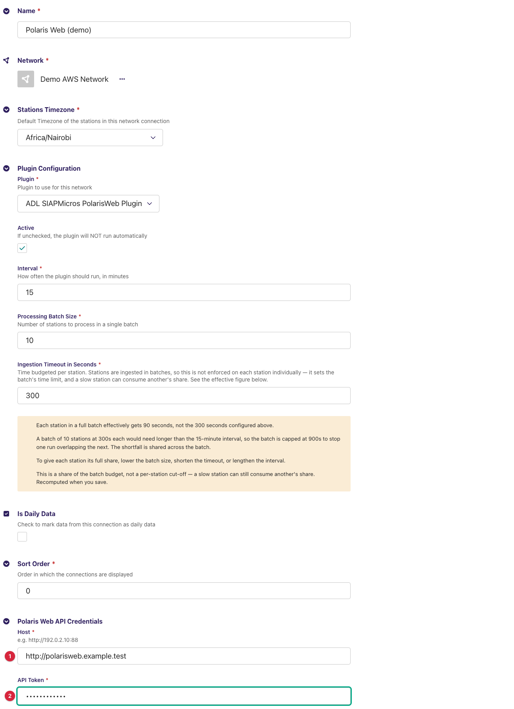
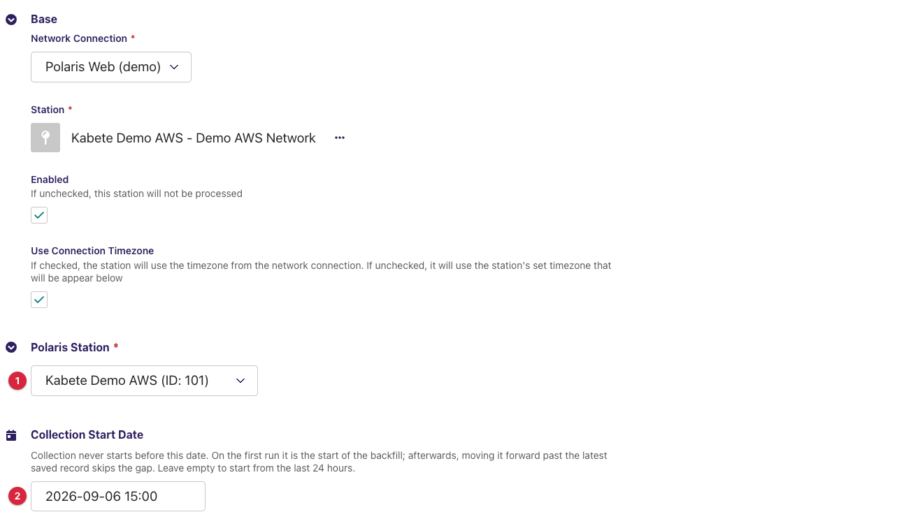
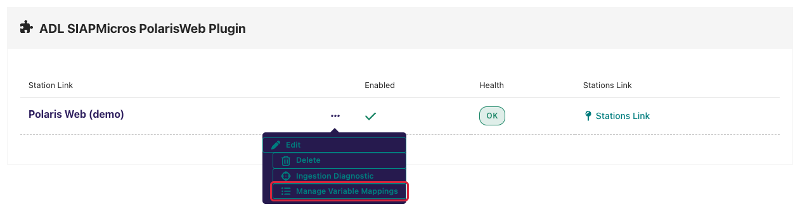
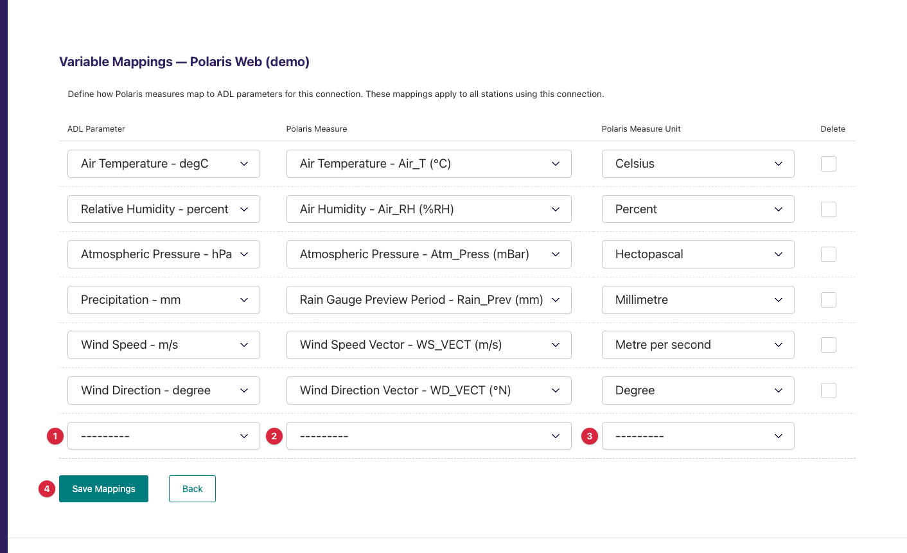
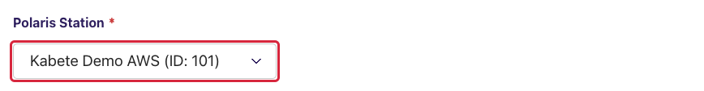
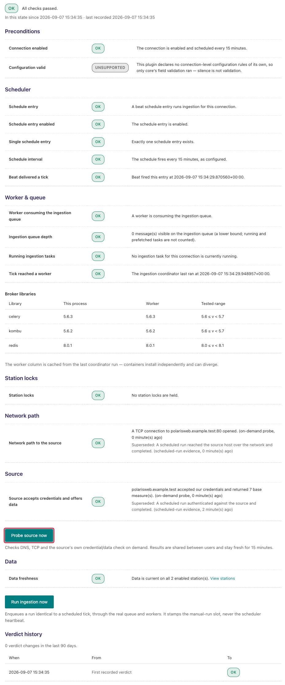
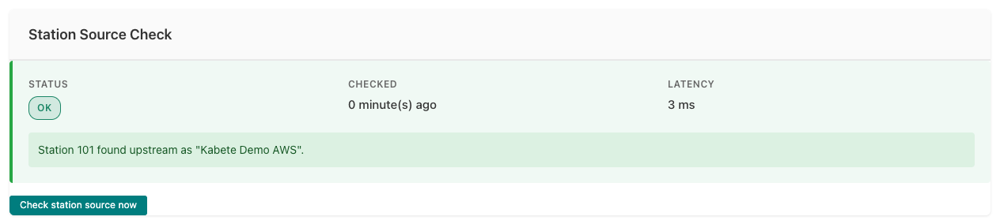

---
adl_plugin:
  name: ADL SIAPMicros PolarisWeb Plugin
  connects_to: SIAP+Micros Polaris Web API
  category: general
  choose_when: Your stations are SIAP+Micros stations managed by a Polaris Web server.
---
# ADL SIAPMicros PolarisWeb Plugin

Collects observation data from **SIAP+Micros** automatic weather stations
through the **Polaris Web REST API** — the web front end of a SIAP+Micros
Polaris data-collection server, usually hosted at the meteorological service
itself — and saves it into an ADL instance. This is a *pull* plugin: on each
collection cycle ADL asks the Polaris Web server for the mapped measures of
each linked station over a time window and stores the returned series
against your ADL stations and data parameters.

**Repository:** [adl-siapmicros-polarisweb-plugin](https://github.com/wmo-raf/adl-siapmicros-polarisweb-plugin)
**Plugin type identifier:** `adl_siapmicros_polarisweb_plugin`
**Connection model:** `PolarisWebConnection` · **Station link model:** `PolarisWebStationLink`

> **About the screenshots.** Every image in this guide is regenerated from
> `docs/screenshots.yml` against a seeded demo instance, so hostnames, station
> names, ids and readings in them are placeholders — not values to copy. The
> field tables are the reference for what to enter.

## Overview

Polaris Web organises data as **stations** (each with a numeric id and a
name) and **base measures** — the catalogue of quantities the server knows,
each with a numeric id, a name, a short name and a unit (`Air Temperature -
T_Air (°C)`, `Rain - Rain_Prev (mm)`). A measure id means the same thing on
every station of the server, which is why variable mappings live on the
**connection** and apply to every station linked under it.

One collection cycle, per enabled station link: the plugin asks the
`/data/series` endpoint for every mapped measure of the station over the
run's window in a single request, merges the returned series by timestamp
into records keyed by measure id, and hands them to ADL, which stores the
mapped parameters after unit conversion.

Both the station list and the measure catalogue are loaded from the server
into the admin forms, so you pick rather than type.

## Prerequisites

- A running ADL instance (see [Installation](https://adl-tool.readthedocs.io/en/latest/installation.html)).
- The **Polaris Web host URL** — scheme, host and port, no path
  (`http://192.0.2.10:88`). Polaris Web servers are commonly reached on
  a non-standard port and often over plain HTTP inside the service's
  network.
- An **API token** for the server, issued by SIAP+Micros or by whoever
  administers the Polaris installation. The token is sent as a query
  parameter on every request.
- Network access from the ADL host to that host and port.

## Installation

Installed like any ADL plugin — see [Plugin Installation](https://adl-tool.readthedocs.io/en/latest/developer_guide/plugins/plugin_installation.html) for
all methods. The `plugins.toml` entry:

```toml
[[plugins]]
name = "ADL SIAPMicros PolarisWeb Plugin"
git  = "https://github.com/wmo-raf/adl-siapmicros-polarisweb-plugin.git"
tag  = "0.1.0"
```

After rebuild/restart, confirm with `docker compose exec adl list-plugins`.

## Connection configuration

In the ADL admin, create a new **Polaris Web API Connection**. Base
connection fields (name, network, plugin, processing interval, stations
timezone) are described in [Manage Connections](https://adl-tool.readthedocs.io/en/latest/user_guide/manage_connections.html).
Plugin-specific fields, under *Polaris Web API Credentials*:

| Field | Required | Default | Description |
|---|---|---|---|
| Host | yes | — | The Polaris Web base URL with scheme and port, e.g. `http://192.0.2.10:88`. The plugin appends `/api/polaris/…`. The host and port here are what the network diagnostic dials — the explicit port matters. |
| API Token | yes | — | The token for the server. Sent as the `api_token` query parameter; the plugin never writes it into messages or logs. |



Variable mappings are **not** on this form: they are edited on a dedicated
page reached from the connection's row action, described under *Admin UI
added by this plugin*. Save the connection first, then open that page.

### Connection-level variable mappings

Each mapping ties one Polaris base measure to one ADL data parameter and
applies to every station on the connection:

| Field | Description |
|---|---|
| ADL Parameter | The ADL `DataParameter` the values are stored under. |
| Polaris Measure | The base measure, chosen from the list the plugin loads from the server. Each option reads *name - short name (unit)*; the stored value is the measure id, which is the key the plugin gives each series. |
| Polaris Measure Unit | The ADL unit matching the unit shown in brackets on the measure. ADL converts from it to the ADL parameter's unit. |

**Example:** ADL Parameter `Air Temperature` ← Polaris Measure *Air
Temperature - T_Air (°C)* → Unit `degC`; ADL Parameter `Precipitation` ←
*Rain - Rain_Prev (mm)* → Unit `mm`.

Only mapped measures are requested from the server. The catalogue's
`Rain_Tot` measure (an accumulated total) is hidden from the list on
purpose, to avoid confusion with the interval measure `Rain_Prev`.

## Station link configuration

For each station to collect, create a **Polaris Web Station Link**:

| Field | Required | Default | Description |
|---|---|---|---|
| Polaris Station | yes | — | The station, chosen from the list the plugin loads from the server once the *Network Connection* above it is selected. Each option reads *name (ID: id)*; the stored value is the numeric id. |
| Collection Start Date | no | empty | Collection never starts before this date, and it must be in the past. On the first run it is the start of the backfill; afterwards, moving it forward past the latest saved record skips the gap. Leave empty to start from the last 24 hours. |



A station link with no mappings on its connection is skipped with a warning
in the task log (`No variable mappings configured for station link … —
skipping.`) — define the mappings before enabling links.

## Admin UI added by this plugin

The plugin adds two surfaces: a **Manage Variable Mappings** page per
connection, and the **remote-loading selects** on that page and on the
station link form. Walk through them in order the first time.

### Step 1 — open Manage Variable Mappings

On the **Network Connections** list, each Polaris Web connection row carries
a **Manage Variable Mappings** action in its **…** menu (list icon). It opens
the mappings page in a new tab.



### Step 2 — the Variable Mappings page

The page is titled **Variable Mappings — <connection name>** and shows one
table with the connection's rows plus one empty row for a new mapping:

| Column | What to do |
|---|---|
| ADL Parameter | Choose the ADL parameter. |
| Polaris Measure | Choose the measure; the list is loaded live from the server when the page opens. |
| Polaris Measure Unit | Choose the ADL unit matching the measure's bracketed unit. |
| Delete | Tick to remove an existing row on save. |

**Save Mappings** writes the rows and reloads the page with a fresh empty
row, so add mappings one at a time: fill the empty row, save, repeat.
**Back** returns to the previous page.



If the *Polaris Measure* select offers only `---------`, the server could not
be reached or refused the token when the page loaded: the plugin logs
`Failed to fetch measures from Polaris API: <error>` and renders the page
without options. Fix the connection (the source check below names the
fault), then reload. A row saved without a measure is refused with `Please
select a valid measure.`

### Step 3 — pick the connection, then the station

On the station link form, select the *Network Connection* first. The
*Polaris Station* select shows a spinner while it fetches the server's
station list, then fills with *name (ID: id)* options sorted by name.
Changing the connection clears and reloads the list. A connection that has
just been created must be saved before its list can load.



### What the selects report when something is wrong

A message above a select replaces its options when the call behind it fails:

| Message | Meaning | What to do |
|---|---|---|
| `Network connection ID is required.` | No connection is selected yet. | Select the *Network Connection* first. |
| `The selected connection is not a Polaris Web API Connection.` | The chosen connection belongs to another plugin. | Pick a Polaris Web connection. |
| `No measures found for the selected connection.` | The server returned an empty measure catalogue. | Check the server's configuration with its administrator. |
| `HTTP error! Status: 500` (or an empty list with no message) | The API call itself failed — wrong host or token, or no network. | Run *Probe source now* on the connection's Ingestion Diagnostic page; the feedback catalogue maps the result to a fix. |

## Data collection behavior

- **Window.** Each run asks for the window from the later of the latest
  saved observation plus one minute and the *Collection Start Date*, up to
  the top of the next hour. With neither, the first run starts **24 hours
  ago**.
- **Request.** One call per station per run to `/api/polaris/data/series`,
  carrying the window as `YYYYMMDDHHMM` bounds and one entry per mapped
  measure (`<station id>_<measure id>`, validated data), with a 30-second
  timeout. The server applies the window.
- **Timezones.** Window bounds are written in the station's local time as
  ADL computes them, and the returned timestamps (`YYYY-MM-DD HH:MM`) are
  read the same way and stamped with the station's timezone. Set the
  connection's *Stations Timezone* to the timezone the Polaris server
  reports in — usually the country's local time.
- **Records.** The series of all mapped measures are merged by timestamp
  into one record per instant, keyed by measure id. A `null` value is
  skipped; a value or timestamp that cannot be parsed is skipped with a
  warning in the task log (`Could not parse value … for measure … at …`).
- **Backfill.** Set *Collection Start Date* before the first run; the
  server serves history and the run fetches the whole window in one
  request. Very long windows produce large responses — start with a few
  months.
- **Caches.** The station list and the measure catalogue are cached for 24
  hours per token (they drive the selects and the mappings page). Series
  are never cached.

## Source checks / diagnostics

The plugin implements the ADL source-check contracts, so the core's
monitoring screens can tell network faults, token faults and configuration
faults apart *for this connection specifically*. The screens below are
rendered by the ADL core, but what they display for a Polaris Web connection
comes from this plugin. The core's own messages on the same screens are
catalogued in [Monitoring & Diagnostics](https://adl-tool.readthedocs.io/en/latest/user_guide/monitoring_and_diagnostics.html).

### Where check results appear

**Ingestion Diagnostic page.** From the connections list, the Health column
of your Polaris Web connection links to its **Ingestion Diagnostic** page
(`/monitoring/connection/<id>/health/`). It shows a layered verdict —
network reachability of the *Host*'s address and port at the bottom, then
whether the server accepted the token — with a verdict history. **Probe
source now** re-dials the source immediately (at most once per minute);
**Run ingestion now** triggers a full collection cycle.



**Station Source Check panel.** Open a station link's **Inspect** page (from
the station links list, via the row's **…** menu). Alongside the Collection
Status card — which also offers **Trigger Collection Now** — the **Station
Source Check** card shows the latest station-level result: a status badge
(OK / FAILED), when it was checked, the latency, and the message produced by
this plugin.



### What each check verifies

| Check | What it verifies |
|---|---|
| Endpoint probe | DNS resolution and TCP reach of the host **and port** in *Host* (`192.0.2.10:88` in the example). Run by the core; the plugin only names the endpoint. |
| Connection check | Reads the base-measure catalogue (`/api/polaris/base_measures`) fresh — cache bypassed, 5-second timeout, no retries — with the token, claiming OK only from a parsed list, never from a bare HTTP 200. |
| Station check | Confirms the configured station id appears in the server's current station list, also bypassing the cache, and reports the upstream name so a valid-but-wrong id is caught. |

### Feedback catalogue — messages this plugin produces

Messages name the host from *Host* (shown here as `192.0.2.10`) and
paths without the query string, so the token never appears in them. Find
the message you see:

| Message (example) | Status | Meaning | What to do |
|---|---|---|---|
| `192.0.2.10 accepted our credentials and returned 38 base measure(s).` | OK | Token valid; the catalogue is readable. The count is the number of measures the server defines. | Nothing — healthy. |
| `Station 12 found upstream as "Conakry Aéroport".` | OK | The id exists on the server; the name is shown so you can confirm it is the station you meant. | Check the name matches your intended station. |
| `Station 12 was found in the source's station list.` | OK | As above, but the server gave the station no name. | Nothing. |
| `192.0.2.10 returned HTTP 401 for /api/polaris/base_measures.` | FAILED | The server rejected the token. | Re-enter *API Token*. |
| `192.0.2.10 returned HTTP 403 for /api/polaris/base_measures.` | FAILED | Token accepted but lacks permission. | Ask the server administrator about the token's rights. |
| `192.0.2.10 returned HTTP 404 for /api/polaris/base_measures.` | FAILED | Nothing answers at that path — *Host* points to the wrong place (a path in the URL, or another web server on that port). | Fix *Host*: scheme, host and port only. |
| `192.0.2.10 returned HTTP 5xx for /api/polaris/base_measures.` | FAILED | The Polaris server errored. | Check the server with its administrator. |
| `192.0.2.10 answered, but the response was not a base-measure list.` | FAILED | Something responded, but not the API — a login page, a proxy, or a body without an `items` list. | Check *Host* and any proxy between ADL and the server. |
| `192.0.2.10 could not be reached: <error>` | FAILED | Network-level failure: DNS, refused port, or timeout. The wrapped error says which. | Check connectivity from the ADL host to the host and port. |
| `Station 12 was not found in the source's station list.` | FAILED | Positive proof the id is absent — the station was removed or renumbered on the server. | Re-select the station on the station link form. |
| `192.0.2.10 answered, but the response was not a station list.` | FAILED | The station listing came back in an unexpected shape. | Check *Host*; report if persistent. |
| `Could not read the station list from 192.0.2.10: <error>` | FAILED | The station check could not fetch the list, so it proves nothing about this station. | Fix the connection-level failure first, then re-check. |

## Troubleshooting

**Connection check passes but a station collects nothing**
: Confirm the station check passes, then check that the connection has
  variable mappings (a link with none is skipped with a warning) and that
  the mapped measures are ones this station actually records — the
  catalogue is server-wide, not per station.

**Timestamps are offset by a fixed number of hours**
: The connection's *Stations Timezone* does not match the timezone the
  Polaris server reports in. Set it accordingly; the window and the stored
  times shift together.

**Rain values look like a running total**
: A `Rain_Tot`-style accumulated measure was mapped. Map the interval
  measure (`Rain_Prev`) instead; the catalogue hides `Rain_Tot` for this
  reason, but older mappings may still carry it.

**The measure select on the mappings page is empty**
: The server could not be reached or refused the token when the page
  opened. Run *Probe source now* on the Ingestion Diagnostic page, fix what
  it names, then reload the mappings page.

**The Ingestion Diagnostic's network layer fails although a browser reaches the server**
: The port in *Host* is missing or wrong, or the ADL host cannot reach the
  server's port while your workstation can (different network segment).
  Check *Host* includes the port and ask for a firewall rule from the ADL
  host.

## Compatibility

| Plugin version | Requires ADL core | Notes |
|---|---|---|
| 0.1.0 | Core with source-check contracts for full diagnostics (≥ 0.8.12) | Runs on older cores too; the source-check integration is simply inactive there. |

## Changelog

See [GitHub Releases](https://github.com/wmo-raf/adl-siapmicros-polarisweb-plugin/releases).
