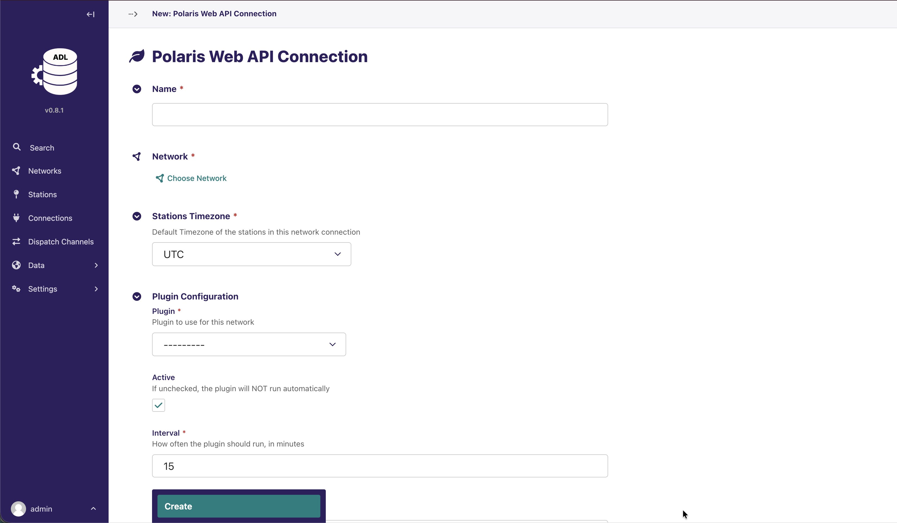
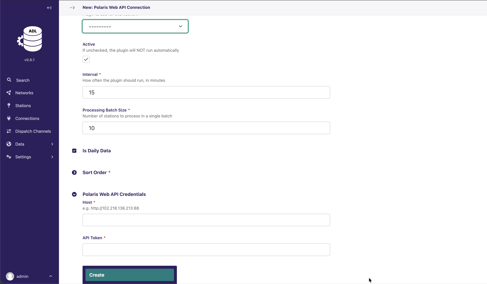
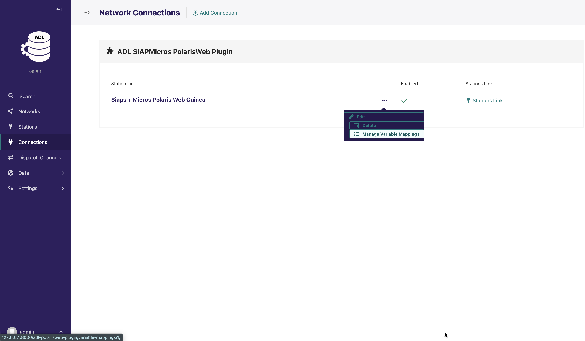
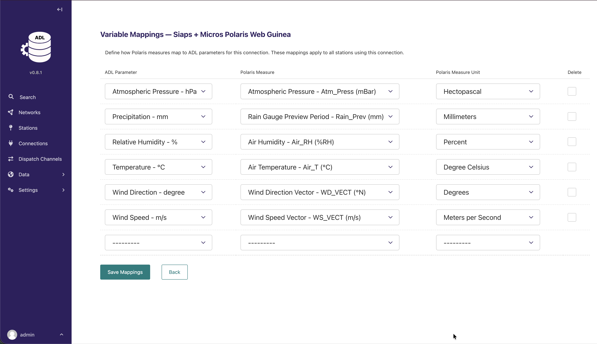
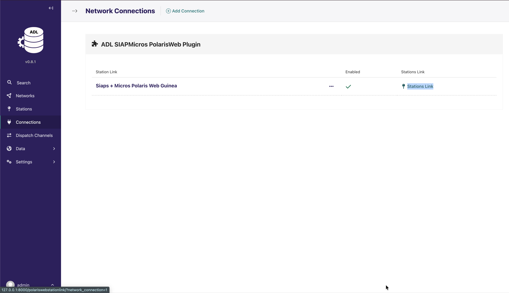
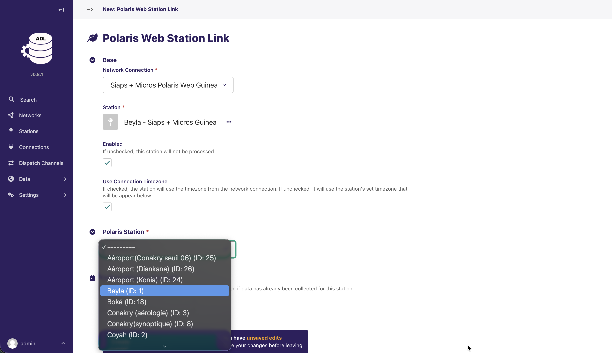
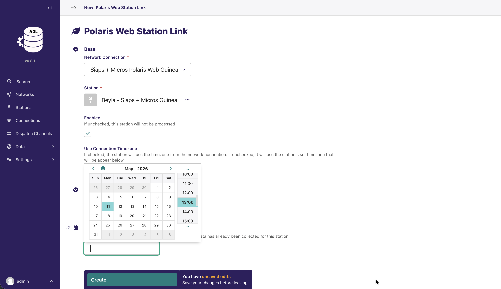
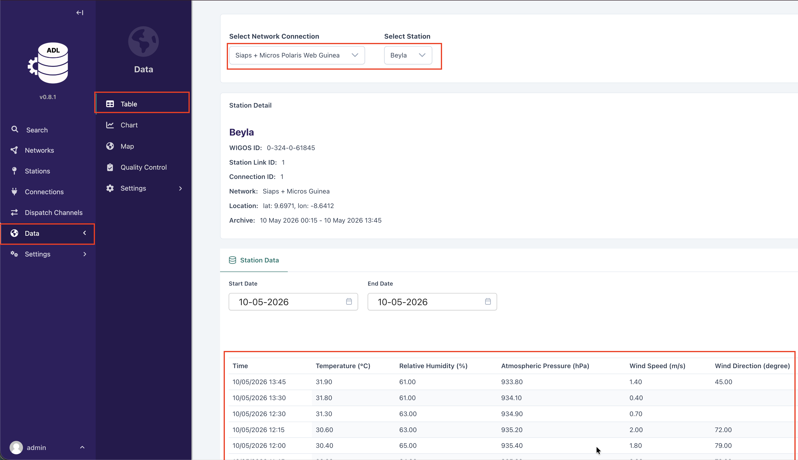

# ADL SIAPMicros PolarisWeb Plugin — User Guide

An ADL plugin for collecting observation data from the SIAP+Micros Polaris Web API and saving it to the ADL database.

---

## Table of Contents

1. [Prerequisites](#prerequisites)
2. [Installation](#installation)
3. [Step 1 — Create a Connection](#step-1--create-a-connection)
4. [Step 2 — Configure Variable Mappings](#step-2--configure-variable-mappings)
5. [Step 3 — Link Stations](#step-3--link-stations)
6. [Step 4 — Enable Data Collection](#step-4--enable-data-collection)
7. [Troubleshooting](#troubleshooting)

---

## Prerequisites

- A running ADL instance
- Access credentials for a SIAP+Micros Polaris Web API instance (host URL and API token)
- A Network and Station(s) set up in ADL that correspond to the Polaris Web API stations you want to collect data from

---

## Installation

Follow the standard ADL plugin installation process. Once installed and the container restarted.

---

## Step 1 — Create a Connection

A **Connection** represents one Polaris Web API instance. All stations sharing the same API endpoint use a single
connection.

1. In the ADL admin sidebar, navigate to **Connections**.
2. Click **Add** and select **Polaris Web API Connection**.
3. Fill in the following fields:

| Field         | Description                                        | Example                     |
|---------------|----------------------------------------------------|-----------------------------|
| **Name**      | A descriptive name for this connection             | `SIAP Guinea`               |
| **Host**      | The base URL of the Polaris Web instance (no path) | `http://102.218.136.213:88` |
| **API Token** | The API token provided by SIAP+Micros              | `your_token_here`           |

4. Click **Save**.





---

## Step 2 — Configure Variable Mappings

Variable mappings tell ADL how to translate Polaris measures (e.g. Air Temperature, Rainfall) into ADL parameters.
Mappings are defined once at the connection level and apply to all stations using that connection.

1. After saving the connection, locate it in the **Network Connections** list.
2. Click the **Manage Variable Mappings** button next to the connection.



3. On the Variable Mappings page, click **Add** to add a new row.
4. For each mapping, fill in:

| Field                    | Description                                            |
|--------------------------|--------------------------------------------------------|
| **ADL Parameter**        | The ADL parameter to map to (e.g. `Air Temperature`)   |
| **Polaris Measure**      | Select from the dropdown — populated live from the API |
| **Polaris Measure Unit** | The unit in which the Polaris API returns this measure |

5. Add one row per measure you want to collect.
6. Click **Save Mappings**.



> **Note:** The Polaris Measure dropdown is loaded live from the API. If it appears empty, verify the Host and API Token
> on the connection are correct.

---

## Step 3 — Link Stations

A **Station Link** connects an ADL station to its corresponding station in the Polaris Web API.

1. In the ADL admin, navigate to the station you want to link.
2. Under **Station Links**, click **Add Station Link** and select **Polaris Web Station Link**.
3. Fill in the following fields:

| Field                             | Description                                                                             |
|-----------------------------------|-----------------------------------------------------------------------------------------|
| **Network Connection**            | Select the Polaris Web connection created in Step 1                                     |
| **Polaris Station**               | Select the station from the dropdown — populated live from the API                      |
| **Initial Collection Start Date** | Optional. Set a past date to backfill historical data. Leave blank to collect from now. |

4. Click **Save**.





> **Tip:** The Polaris Station dropdown fetches the station list live from the API using the selected connection. Make
> sure you select the connection first before the dropdown populates.

---

## Step 4 — Enable Data Collection

Once stations are linked, ADL will automatically collect data on each Celery beat cycle based on the connection's
processing interval.

To verify data is flowing:

1. Navigate to **Data > Table **.
2. Select the Connection and Station.
3. Check that recent records are appearing



You can also check the Celery worker logs for any collection errors:

```bash
docker compose logs adl_celery_worker --tail=100
```

---

## Troubleshooting

**Polaris Measure / Station dropdown is empty**

- Verify the **Host** and **API Token** on the connection are correct.
- Check that the Polaris Web API is reachable from the ADL server.
- Check the Django logs for API errors: `docker compose logs adl --tail=100`

**No data appearing in table Records**

- Confirm the station link has been saved and the correct Polaris Station is selected.
- Check that at least one Variable Mapping is configured for the connection.
- Verify the **Initial Collection Start Date** is set correctly if backfilling.
- Check Celery worker logs for errors.